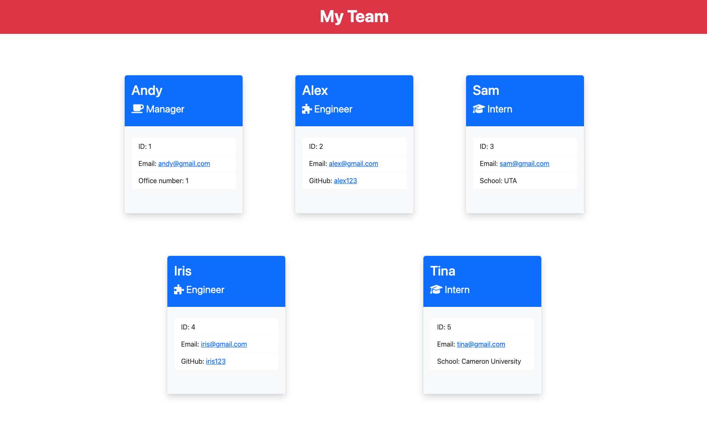

# Team Profile Generator

## Table of Contents:

---

- [Description](#description)
- [Installation](#installation)
- [Usage](#usage)
- [Demo](#demo)
- [License](#license)
- [Test](#test)
- [Questions](#questions)

## Description:

---

This application is created to generate an HTML webpage that displays information about employees on a software engineering team.

## Installation:

---

To install this app, make sure to run:

```
npm i
```

## Usage:

---

After you run npm i, you should have all the dependencies that are needed to use the app. In this case, the dependencies are "Inquirer" and "Jest". Simply run the following command to start the app:

```
node index
```

## Demo :

---

[Click here to watch the demo](https://drive.google.com/file/d/12ADP_vk_LGpp0uRpX7k0El2hg9aKYWvE/view?usp=sharing)



## License:

---

This project is license under:


License Link:

https://choosealicense.com/licenses/mit/

## Test:

Run the following command in your terminal to test this app:

```
npm run test
```

## Questions:

If you have any questions, you may contact me at either <br>
Github: https://github.com/daisy.le0203
<br>
or
<br>
Email: daisy.le0203@gmail.com
